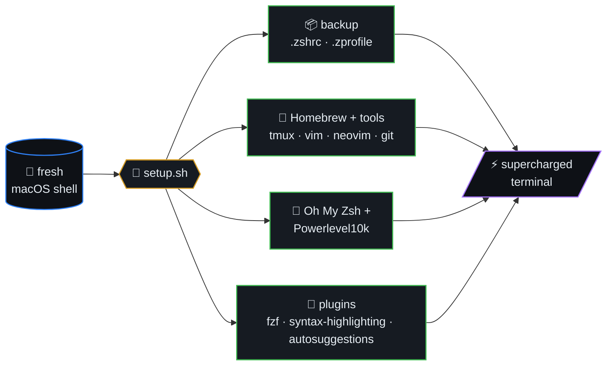
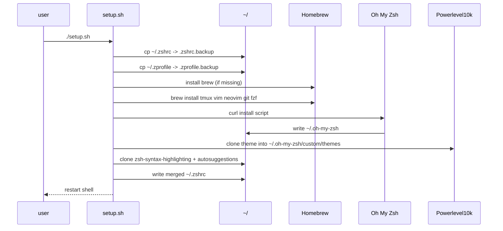
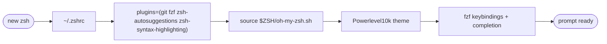
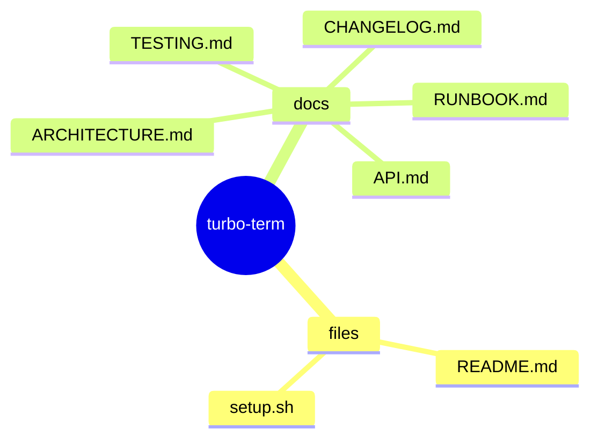
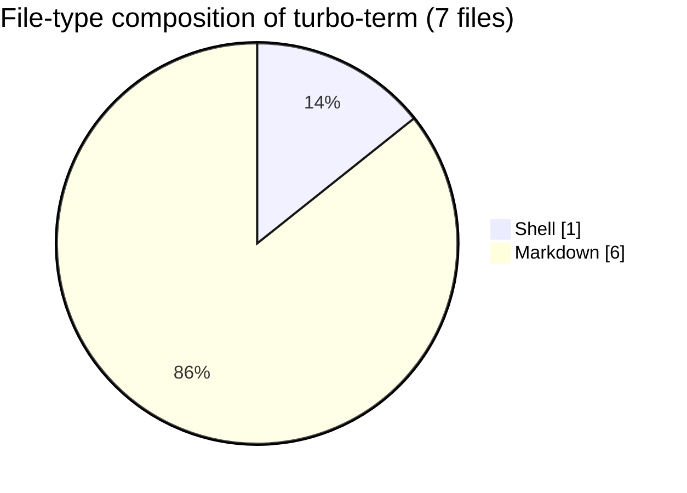

# TurboEnhance

> Turbocharge your **macOS or Linux** terminal with a seamless Zsh setup,
> Powerlevel10k, and essential plugins for maximum productivity!

TurboEnhance is a setup script that streamlines and supercharges your
terminal environment on **macOS (Intel + Apple Silicon)** and on
**Linux (Debian/Ubuntu, Fedora, Arch)**. It installs Zsh, Oh My Zsh,
Powerlevel10k, Nerd Fonts, and a curated set of plugins, so a fresh
shell becomes a highly efficient, visually consistent tool for
developers and power users — without the usual hour of fiddling.



## Table of contents

- [Features](#features)
- [Installation](#installation)
- [Setup pipeline (sequence)](#setup-pipeline-sequence)
- [Plugin activation order](#plugin-activation-order)
- [Documentation](#documentation)
- [🗺️ Repository map](#️-repository-map)
- [📊 Code composition](#-code-composition)

## Documentation

Canonical engineering docs (audience: maintainers + agents):

- [docs/ARCHITECTURE.md](docs/ARCHITECTURE.md) — module map, layers, invariants.
- [docs/API.md](docs/API.md) — invocation contract, exit codes, files written.
- [docs/TESTING.md](docs/TESTING.md) — Definition of Done, verification commands.
- [docs/RUNBOOK.md](docs/RUNBOOK.md) — setup, common failures, how to extend.
- [docs/CHANGELOG.md](docs/CHANGELOG.md) — versioned change history.

## Setup pipeline (sequence)



## Plugin activation order



## Features
- **Automated Zsh Setup**: Installs and configures Zsh with Oh My Zsh.
- **Powerlevel10k Theme**: Set up with Powerlevel10k for a beautiful and functional prompt.
- **MesloLGS Nerd Font**: Installed automatically (macOS Homebrew cask; Linux font directory) and confirmed through the `p10k configure` Meslo prompt so Powerlevel10k icons render correctly.
- **iTerm2 Auto-Configured**: Installs iTerm2 and points its default profile (and Terminal.app's default profile) at `MesloLGS NF` 13pt — no manual font picking required.
- **iTerm2 as Default Terminal**: Registers iTerm2 (via `duti`) as the macOS LaunchServices handler for `.sh`, `.command`, shell-script and `terminal:` URL types, so double-clicked scripts open in iTerm2 instead of Terminal.app.
- **Dark Theme**: iTerm2's default profile gets a dark Dracula-ish color scheme (near-black bg, off-white fg) and Terminal.app is switched to the built-in dark **Pro** profile, so Powerlevel10k's colored prompt segments stay readable.
- **Essential Plugins**: Includes fuzzy search (fzf), syntax highlighting, autosuggestions, and more.
- **Backup Support**: Option to backup your existing `.zshrc` and `.zprofile` files before overwriting.
- **Homebrew Integration**: Automatically installs Homebrew and essential tools if not already present.
- **Cross-Functionality**: Boost productivity with tmux, vim, neovim, git, ripgrep, fd, bat, jq, htop, tree, wget, and expect pre-installed.
- **Fuzzy Finder**: Full fzf integration with autocomplete and keybindings.

## Installation

### Step 1: Clone the Repository
```bash
git clone https://github.com/ml-lubich/turbo-term.git
cd turbo-term
```

### Step 2: Run the setup script
```bash
zsh ./setup.sh
```

The script is idempotent — safe to re-run. It will:
1. Detect your OS (macOS or Linux distro).
2. Back up `~/.zshrc` and `~/.zprofile` (with your confirmation, first run only).
3. Install Homebrew (macOS) or use apt/dnf/pacman (Linux/WSL) to install Zsh, Oh My Zsh, Powerlevel10k, plugins, tmux, vim, neovim, git, fzf, eza, ripgrep, fd, bat, jq, htop, tree, wget, and expect.
4. Install **MesloLGS NF** font (macOS cask; Linux → `~/.local/share/fonts` + `fc-cache`).
5. **macOS only:** install **iTerm2**, set its font to `MesloLGSDZNFM-Regular 13pt`, apply a dark color scheme, switch Terminal.app's default profile to dark **Pro**, and register iTerm2 (via `duti`) as the default handler for `.sh` / `.command` types.
6. **Linux only:** run `chsh -s $(command -v zsh)` if zsh is in `/etc/shells`.
7. Append a single managed block to `~/.zshrc` wired to Powerlevel10k + plugins (preserving any existing customization).

### Step 3: Configure and validate the prompt
- Run through `p10k configure` when setup prompts. Setup sends `y` to the Meslo Nerd Font question when `expect` is present, then gives control back to you.
- **macOS:** Use the fresh iTerm2 window opened by `setup.sh`; the script does not quit the terminal that is running setup.
- **Linux:** Open a new terminal window (or `exec zsh`). Set your terminal emulator's font to **MesloLGS NF** (size 12–13).
- **Windows via WSL:** Run the script in WSL, then set the Windows Terminal profile font face to **MesloLGS NF**.
- Validate icons with `echo $'\uf015 \uf07b \ue0a0'`; they should render as Nerd Font glyphs, not boxes.


## 🗺️ Repository map

Top-level layout of `turbo-term` rendered as a Mermaid mindmap (auto-generated from the on-disk tree).




## 📊 Code composition

File-type breakdown of source under this repo (skips `.git`, `node_modules`, build caches, lockfiles).


