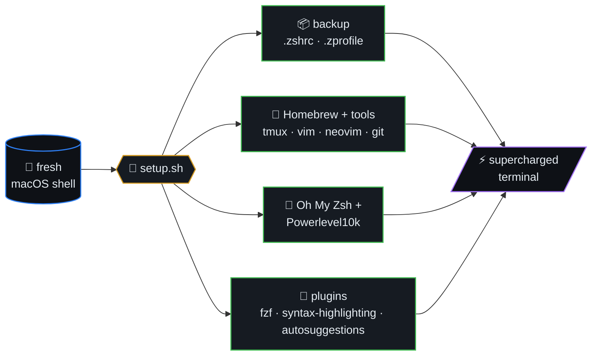
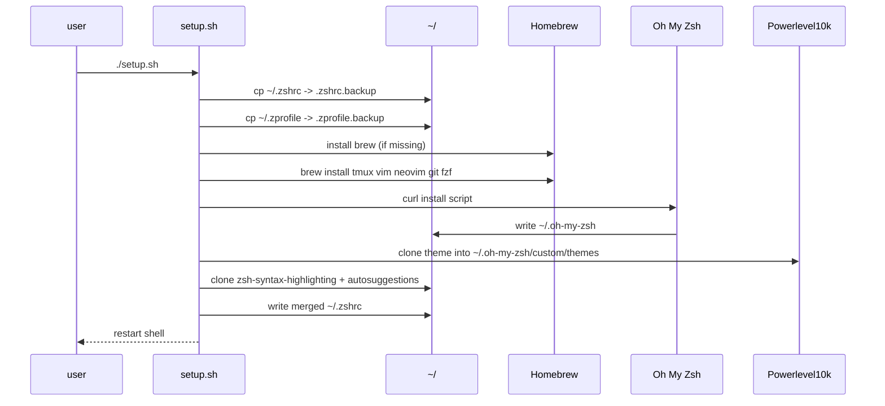
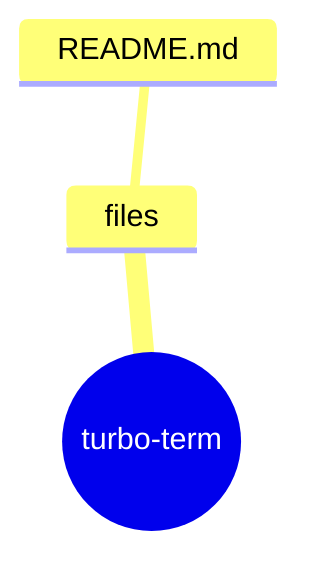

# TurboEnhance

> Turbocharge your macOS terminal with a seamless Zsh setup,
> Powerlevel10k, and essential plugins for maximum productivity!

TurboEnhance is a setup script designed to streamline and supercharge your macOS terminal environment. It automates the installation of Zsh, Oh My Zsh, Powerlevel10k, and essential plugins, transforming your terminal into a highly efficient, visually appealing tool for developers and power users.



## Table of contents

- [Features](#features)
- [Installation](#installation)
- [Setup pipeline (sequence)](#setup-pipeline-sequence)
- [Plugin activation order](#plugin-activation-order)
- [🗺️ Repository map](#️-repository-map)

## Setup pipeline (sequence)



## Plugin activation order


## Features
- **Automated Zsh Setup**: Installs and configures Zsh with Oh My Zsh.
- **Powerlevel10k Theme**: Set up with Powerlevel10k for a beautiful and functional prompt.
- **Essential Plugins**: Includes fuzzy search (fzf), syntax highlighting, autosuggestions, and more.
- **Backup Support**: Option to backup your existing `.zshrc` and `.zprofile` files before overwriting.
- **Homebrew Integration**: Automatically installs Homebrew and essential tools if not already present.
- **Cross-Functionality**: Boost productivity with tmux, vim, neovim, and git pre-installed.
- **Fuzzy Finder**: Full fzf integration with autocomplete and keybindings.

## Installation

### Step 1: Clone the Repository
```bash
git clone https://github.com/your-username/turboenhance.git
cd turboenhance
```


## 🗺️ Repository map

Top-level layout of `turbo-term` rendered as a Mermaid mindmap (auto-generated from the on-disk tree).


