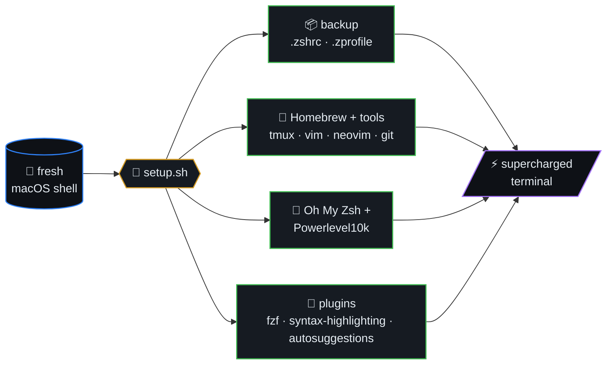
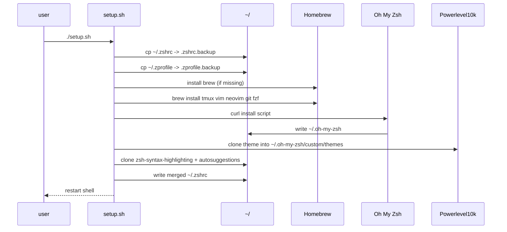
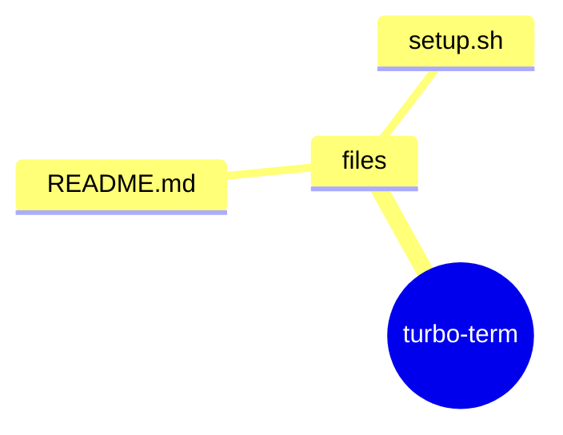
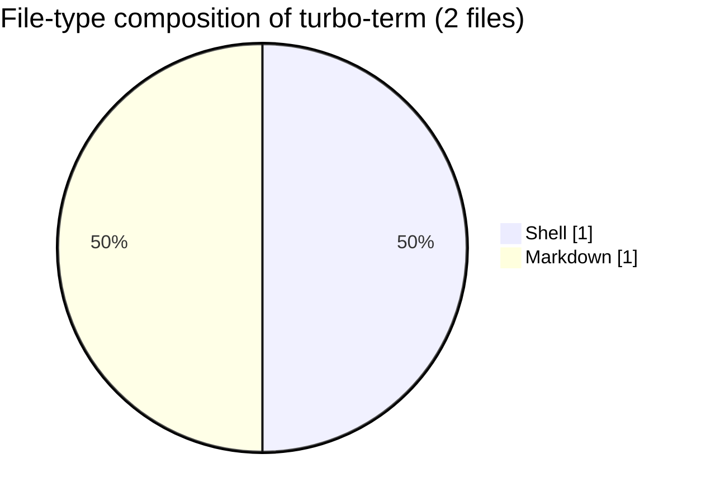

# TurboEnhance

> Turbocharge your macOS terminal with a seamless Zsh setup,
> Powerlevel10k, and essential plugins for maximum productivity!

TurboEnhance is a setup script designed to streamline and supercharge your macOS terminal environment. It automates the installation of Zsh, Oh My Zsh, Powerlevel10k, and essential plugins, transforming your terminal into a highly efficient, visually appealing tool for developers and power users.



## Table of contents

- [Features](#features)
- [Installation](#installation)
- [Setup pipeline (sequence)](#setup-pipeline-sequence)
- [Plugin activation order](#plugin-activation-order)
- [🗺️ Repository map](#️-repository-map)
- [📊 Code composition](#-code-composition)

## Setup pipeline (sequence)



## Plugin activation order


## Features
- **Automated Zsh Setup**: Installs and configures Zsh with Oh My Zsh.
- **Powerlevel10k Theme**: Set up with Powerlevel10k for a beautiful and functional prompt.
- **MesloLGS Nerd Font**: Installed automatically (via Homebrew cask + direct download to `~/Library/Fonts`) so Powerlevel10k icons render correctly. Set your terminal font to `MesloLGS NF`.
- **iTerm2 Auto-Configured**: Installs iTerm2 and points its default profile (and Terminal.app's default profile) at `MesloLGS NF` 13pt — no manual font picking required.
- **iTerm2 as Default Terminal**: Registers iTerm2 (via `duti`) as the macOS LaunchServices handler for `.sh`, `.command`, shell-script and `terminal:` URL types, so double-clicked scripts open in iTerm2 instead of Terminal.app.
- **Dark Theme**: iTerm2's default profile gets a dark Dracula-ish color scheme (near-black bg, off-white fg) and Terminal.app is switched to the built-in dark **Pro** profile, so Powerlevel10k's colored prompt segments stay readable.
- **Essential Plugins**: Includes fuzzy search (fzf), syntax highlighting, autosuggestions, and more.
- **Backup Support**: Option to backup your existing `.zshrc` and `.zprofile` files before overwriting.
- **Homebrew Integration**: Automatically installs Homebrew and essential tools if not already present.
- **Cross-Functionality**: Boost productivity with tmux, vim, neovim, and git pre-installed.
- **Fuzzy Finder**: Full fzf integration with autocomplete and keybindings.

## Installation

### Step 1: Clone the Repository
```bash
git clone https://github.com/ml-lubich/turbo-term.git
cd turbo-term
```

### Step 2: Run the setup script
```bash
zsh ./setup.sh
```

The script is idempotent — safe to re-run. It will:
1. Back up `~/.zshrc` and `~/.zprofile` (with your confirmation).
2. Install Homebrew, Zsh, Oh My Zsh, Powerlevel10k, plugins, tmux, vim, neovim, git, fzf.
3. Install **MesloLGS NF** font (cask + direct download to `~/Library/Fonts`).
4. Install **iTerm2**, set its font to `MesloLGS NF 13pt`, and apply a dark color scheme.
5. Switch Terminal.app's default profile to the dark **Pro** profile + `MesloLGS NF`.
6. Register iTerm2 (via `duti`) as the default handler for `.sh` / `.command` / shell-script types.
7. Write a fresh `~/.zshrc` wired to Powerlevel10k + plugins.

### Step 3: Restart your terminal
Quit and relaunch iTerm2. On first launch Powerlevel10k will run `p10k configure` — pick your prompt style. Done.


## 🗺️ Repository map

Top-level layout of `turbo-term` rendered as a Mermaid mindmap (auto-generated from the on-disk tree).




## 📊 Code composition

File-type breakdown of source under this repo (skips `.git`, `node_modules`, build caches, lockfiles).


